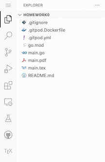
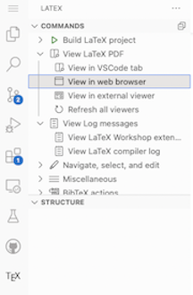
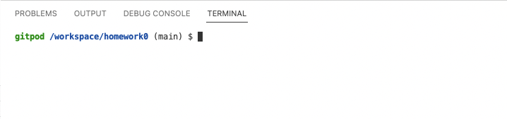

## Homework 0: Due 2022.08.23

Welcome to the Fall 2022 instance of CSCE 557/Math 587. This assignment is intended to
familiarize you with tools used in this course.

- If you don't have an account at GitHub, sign up at [https://github.com/join](https://github.com/join).
- Send me your GitHub username but don't hit send yet.
- Start a new GitHub Codespace using [instructions](https://docs.github.com/en/codespaces/getting-started/quickstart).
- Open `main.tex` in the side bar.

  

- Click on the TeX icon > View Latex PDF > View in web browser and then click through the popup. This
will open up the pdf in a separate tab/window.

  

- Try to edit `main.tex`, save your edits, and refresh the tab with the viewer to see the changes.
- Close the `main.tex` tab and the separate pdf viewer.
- Open `Main.lean`. You will see a new pane open on the right with the name Lean Infoview.
(You may need to click the Restart File button on the lower right corner of infoview to get
Lean to talk to you.)
- Hover over the `#eval` line and note the output in the infoview pane.
- Send me your GitHub username and the message from `#eval`.
- Enter `lake test` in the program in the terminal pane.

  

- Poke around to try to make the test pass.

- When you are satisfied, stop your Codespace. On Windows/Linux enter Control-Shift-P `⌃ + ⇧ + P'
or on MacOS Command-Shift-P `⌘ + ⇧ + P` and select `Codespaces:  Stop Current Codespace`. If
you don't see it in the search bar that pops up, start typing it and it show up.

Note that only things I expect to receive from you is your GitHub username, the `#eval` output, and any complaints :)
